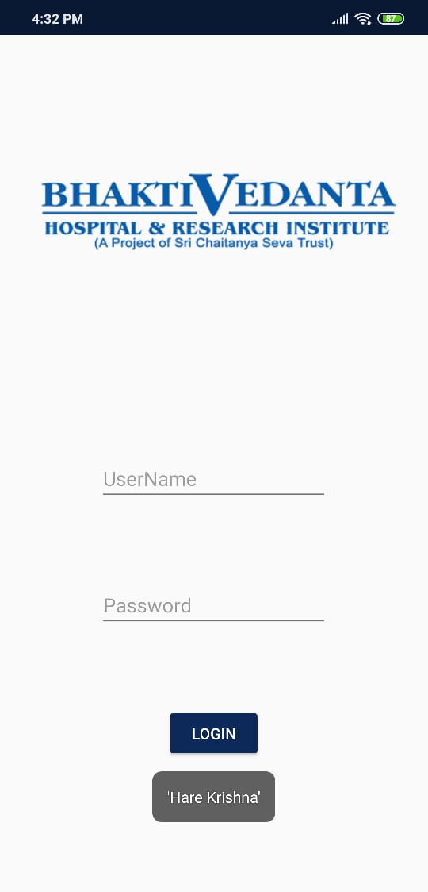
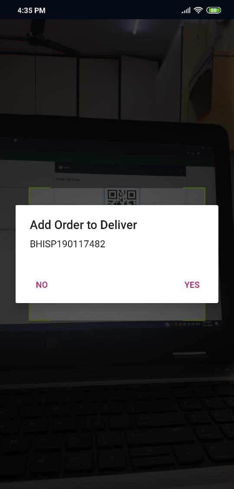
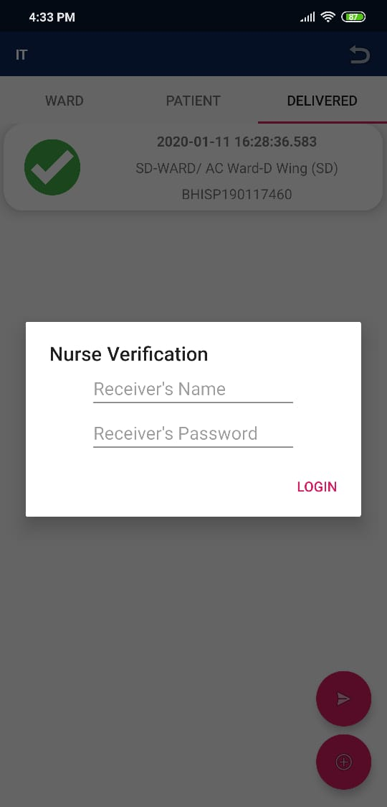
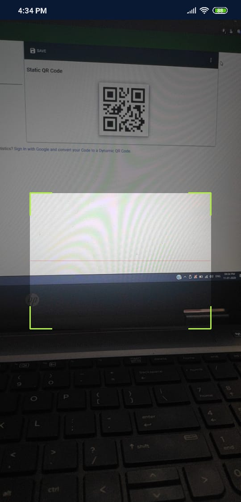

# Pharmacy Delivery App
## Pharmacy (In-Housse) Delivery App (Android) for *BhaktiVedanta Hospital and Research Institute*
### About the Project
A Delivery App for the Delivery Boys at BhaktiVedanta Hospital, helping them in keeping track of the various deliveries that are to be made to the different wards and patients admitted at the hospital
Helping to keep track of the time between the Pick-up and Drop-off
An insight to the map the efficiency of the Delivery Boys

**FEATURES**

 - Realtime
 - Easy-to-Use
 - Lightweight
 - Beautiful and Interactive UI
 - QR Scanner (Works for both Bar Code and QR Code)
 - 24x7 Connectivity to In-House Hosted Server (MS SQL)

## Screenshots

1.Complete App (Screen Record)

[Click Here to Play](Screenshots/ScreenRecord.mp4)

***

2.Delivery Boy Login

***

3.Dashboard

***

4.Delivery Boy Scanner

***

5.Nurse Verification

***

6.Nurse Scanner

***
**Tools used**  

 - Android Studio (Obviously)
 - Adobe Illustrator (Logo and UI Components)
 - Zxing Bar-code Scanner Library
